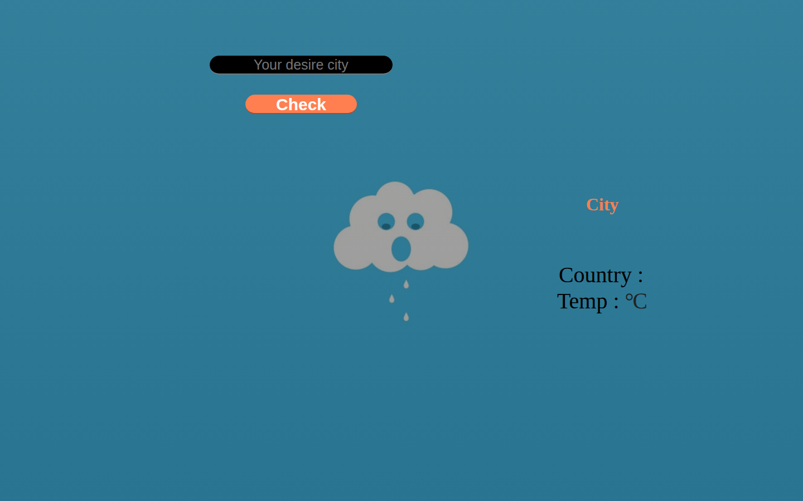

# AJAX Weather Update

[](https://salmanaabir.github.io/ajax-weather-update/)
[](https://developer.mozilla.org/en-US/docs/Web/HTML)
[](https://developer.mozilla.org/en-US/docs/Web/CSS)
[](https://developer.mozilla.org/en-US/docs/Web/JavaScript)
[](https://jquery.com/)

A lightweight weather lookup app. Type a city name, click **Check**, and the page fetches the current temperature and country with an AJAX request to the [Weatherstack](https://weatherstack.com/) API — no page reload.

**Live demo:** [https://salmanaabir.github.io/ajax-weather-update/](https://salmanaabir.github.io/ajax-weather-update/)



## Overview

This is a static front-end project. `index.html` provides the search form and result labels, `style.css` lays out a full-screen weather-themed UI, and `app.js` sends a jQuery `$.ajax` call to Weatherstack, then fills in the city, country, and temperature in Celsius.

## Features

- Search current weather by city name
- Display city, country, and temperature (°C)
- Asynchronous AJAX fetch — the page does not reload
- Full-screen weather-themed layout with a city search field and Check button

## Tech stack

| Layer | Technology |
| --- | --- |
| Markup | HTML5 |
| Styling | CSS3 |
| Logic | JavaScript (ES5) |
| Library | jQuery 1.12.4 |
| UI extras | jQuery UI 1.12.1 |
| Weather data | [Weatherstack Current Weather API](https://weatherstack.com/documentation) |

## Dependencies

There is no `package.json` or build step. Everything is loaded as static files plus two CDNs:

| Dependency | Version | How it is loaded |
| --- | --- | --- |
| [jQuery](https://code.jquery.com/jquery-1.12.4.js) | 1.12.4 | CDN in `index.html` |
| [jQuery UI](https://code.jquery.com/ui/1.12.1/jquery-ui.js) | 1.12.1 | CDN in `index.html` (script + theme CSS) |
| [Weatherstack API](https://weatherstack.com/) | Current weather endpoint | AJAX URL in `app.js` |

Local project files: `index.html`, `style.css`, `app.js`, and the background image `weather-forecast-london-uk-1280x800.jpg`.

A Weatherstack access key is required. The key used by the app lives in `app.js`. If requests start failing, create a free key at [weatherstack.com](https://weatherstack.com/) and replace the `access_key` query parameter.

## Run locally

**Requirements:** a modern browser. Python 3 is optional, for a local HTTP server.

```bash
git clone https://github.com/SalmanAAbir/ajax-weather-update.git
cd ajax-weather-update
```

### Option 1 — open the file

Open `index.html` in your browser (double-click, or `open index.html` on macOS / `xdg-open index.html` on Linux).

### Option 2 — local server (recommended)

The Weatherstack URL in this project uses `http://`. Serving over HTTP avoids mixed-content blocking that can happen on HTTPS pages.

```bash
python3 -m http.server 5500
```

Then visit [http://localhost:5500](http://localhost:5500).

Type a city (for example `Dhaka` or `London`) and click **Check**. City, country, and temperature should appear on the right.

## Links

| | |
| --- | --- |
| Live demo | [https://salmanaabir.github.io/ajax-weather-update/](https://salmanaabir.github.io/ajax-weather-update/) |
| Source repository | [https://github.com/SalmanAAbir/ajax-weather-update](https://github.com/SalmanAAbir/ajax-weather-update) |
| Weatherstack docs | [https://weatherstack.com/documentation](https://weatherstack.com/documentation) |
| jQuery | [https://jquery.com/](https://jquery.com/) |
| jQuery UI | [https://jqueryui.com/](https://jqueryui.com/) |
